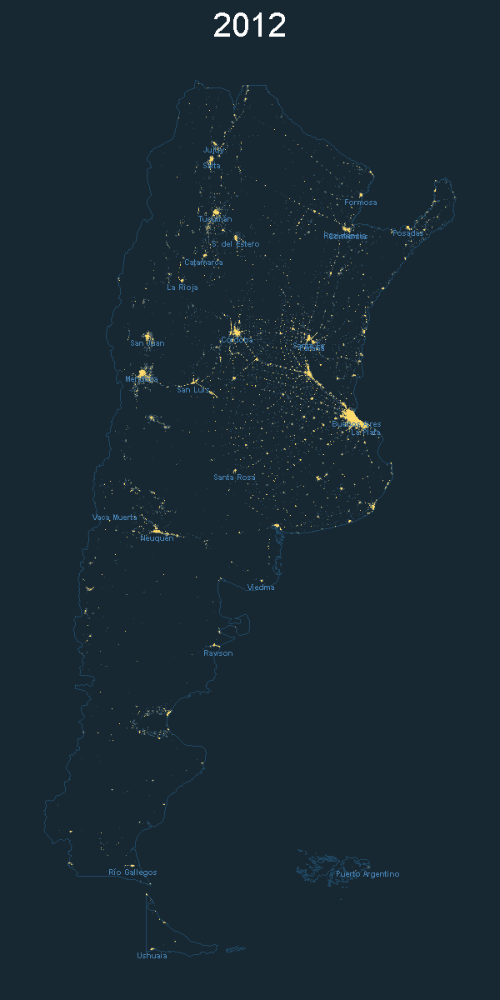
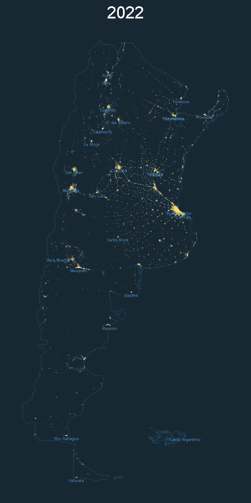
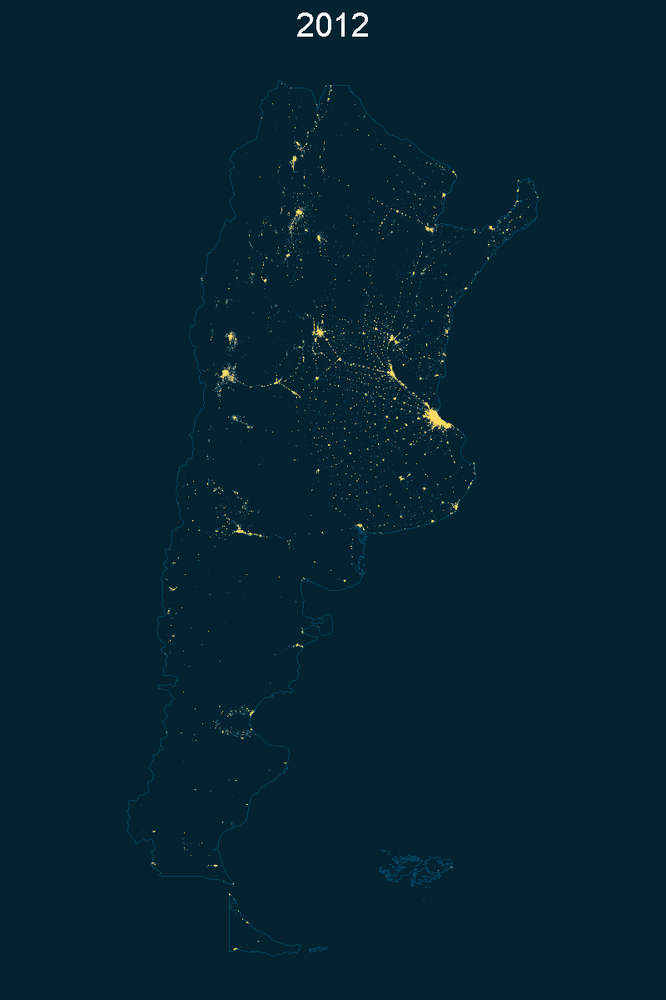

# Visualize Night Light Comparison with R
## Carlos Marcos | Octubre 2023

Este proyecto se enfoca en la visualización de la comparación de luces nocturnas por país utilizando R. El código se basa en un tutorial de Milos Popovic.

## Origen de los Datos
Los datos utilizados en este proyecto fueron obtenidos del sitio web del [Earth Observation Group](https://payneinstitute.mines.edu/eog/). Utilizando la tecnología VIIRS, se generó una nueva serie de datos anuales de luces nocturnas globales que abarca desde 2012 hasta 2020.

## Metodología de Procesamiento
Actualmente, se emplea una metodología que se basa en la generación de imágenes mensuales de luces nocturnas libres de nubes, las cuales se combinan para obtener un resumen anual. Ambos métodos incluyen la eliminación de valores atípicos para descartar datos de incendios y aislar el fondo. Sin embargo, la nueva metodología utiliza la mediana de doce meses para eliminar los valores extremadamente altos o bajos en lugar de un enfoque basado en gráficos.

Se presta especial atención a la definición de un umbral de datos de fondo, que se adapta a los niveles de cobertura de nubes. El objetivo es detectar la iluminación de manera consistente en cada celda de 15 segundos de arco a lo largo de los años en la serie de datos.

## Elasticidad de Luces Nocturnas y Actividad Económica
En estudios recientes, se destaca la posibilidad de estimar la relación (elasticidad) entre las luces nocturnas registradas por satélite y la actividad económica del área observada. La elasticidad estimada es de 1.55 para mercados emergentes y economías en desarrollo, lo que significa que un aumento del 1 por ciento en el producto interno bruto (PIB) se asocia con un aumento del 1.55 por ciento en las luces nocturnas. Esto permite estimar la variación de la actividad económica cuando otros indicadores no están disponibles o evaluar la coherencia de los valores publicados por un país o región en base a este indicador independiente.

## Requisitos
Asegúrate de tener las siguientes bibliotecas instaladas antes de ejecutar el código:
- tidyverse
- terra
- sf
- giscoR

## Demostración
El código anterior crea mapas de comparación de luces nocturnas por país para los años 2012 y 2022. Puedes encontrar las imágenes resultantes en este repositorio para Argentina y otros países.

### Mapas para Argentina
Comparando los años 2012 y 2022, solo el desarrollo de Vaca Muerta, un extenso yacimiento de hidrocarburos no convencionales ubicado en la cuenca Neuquina, parece marcar la diferencia.

<table>
  <tr>
    <td align="center">
      
    </td>
    <td align="center">
      
    </td>
  </tr>
</table>

### Países Limítrofes
Dentro de la carpeta *plots*, encontrarás visualizaciones comparativas para los mismos años en países limítrofes a Argentina.

### Archivos GIF
Una sencilla forma de visualizar la diferencia es mediante archivos GIF que muestran la transición de la imagen entre el año inicial y el final. Puedes encontrar estos archivos para los mismos países en la carpeta *gifs*. Se utilizaron la aplicación Photoshop en su versión 6 para generarlos.

Un ejemplo ilustrativo es la evolución de Argentina:

  

